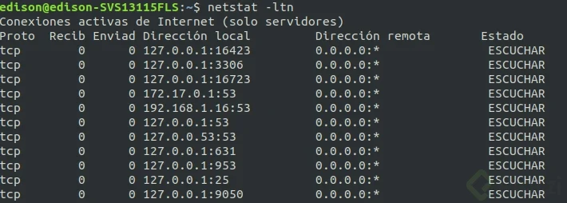
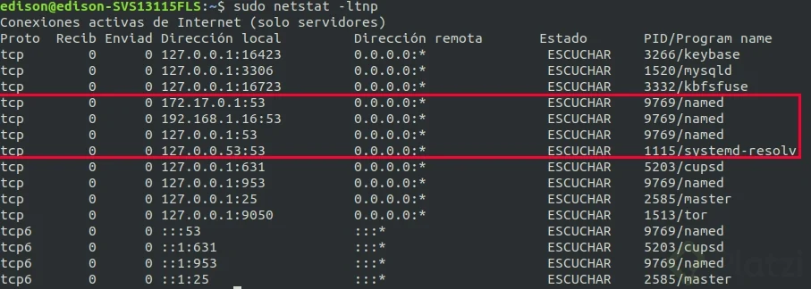
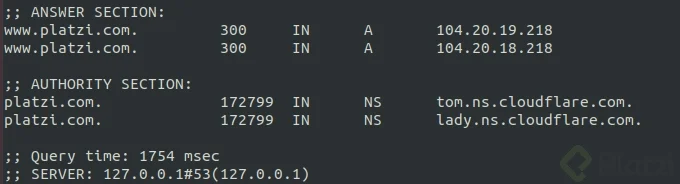
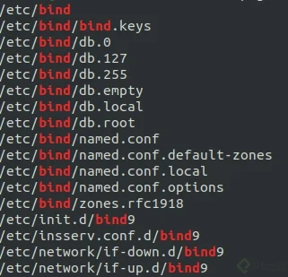

- id : nos muestra el identificador único (uid) de cada usuario en nuestro sistema operativo. El 
ID 0 está reservado para el usuario root.
OjO en distribuciones basadas Debian la creacion de usuarios(uid) empieza en 1000
en CentOs empieza en 500
- whoami : Con el comando whoami podemos ver con qué usuario estamos trabajando en este momento. Podemos ver todos los usuarios del sistema leyendo el archivo /etc/passwd.
Las contraseñas de los usuarios están almacenadas en el archivo /etc/shadow, pero están cifradas. Y solo el usuario root tiene permisos de lectura/escritura.

Para cambiar la contraseña de nuestros usuarios usamos el comando passwd.
gid : GROUP ID

```sh
 cat /atc/passwd

 # outpút
 root:x:0:0:root:/root:/bin/bash # la x significa que su contraseña esta cifrada
 blabla
```

Para automatizar la creacion, elimacion de cuentas

Comandos para administrar cuentas de usuarios:

- sudo useradd nombre-usuario: crea un usuario sin asignarle inmediatamente alguna
  contraseña ni consultar más información. Debemos terminar de configurar esta cuenta a mano
  posteriormente.
- sudo adduser nombre-usuario: crea un nuevo usuario con contraseña y algo más de información.  
  También creará una nueva carpeta en la carpeta /home/.
- userdel nombre-usuario: eliminar cuentas de usuarios.
- usermod: modificar la información de alguna cuenta.

Nunca modifiques a mano el archivo /etc/passwd. Para administrar los usuarios debemos usar los comandos anteriores

## **Grupos**

Los grupos nos ayudan a darle los mismos permisos a diferentes usuarios al mismo tiempo, sin necesidad de asignar el mismo permiso a cada usuario individualmente. Todos los usuarios que pertenezcan al mismo grupo tendrán los mismos permisos.

- su - usuario: Switch User, cambia de usuario
- groups usuario: Muestra a que grupos pertenece cierto usuario
- sudo gpasswd -a usuario grupo: Agrega un usuario a un grupo
- sudo gpasswd -d usuario grupo: Quita a un usuario de un grupo
- usermod -aG grupo usuario: Agrega un usuario a un grupo
- sudo -l: Muestra que permisos tiene el usuario actual

Siguiendo el ejemplo, para hacer que el usuario nodejs sea Administrador:

En Ubuntu:
  - sudo gpasswd -a nodejs sudo
En Centos:
  - sudo gpasswd -a nodejs wheel

para remover el usuario del grupo usando usermod

sudo usermod -G [grupo] [usuario]

Para este ejemplo si queremos quitar a nodejs del grupo de sudo
queda asi

sudo usermod -G nodejs nodejs

## **PAM para el control de acceso de usuarios**

> https://likegeeks.com/es/linux-pam/

PAM es un mecanismo para administrar a los usuarios de nuestro sistema operativo. Nos permite autenticar usuarios, controlar la cantidad de procesos que ejecutan cada uno, verificar la fortaleza de sus contraseñas, ver la hora a la que se conectan por SSH, entre otras.

```sh
  # en etc se guardaran archivos de configuracion, como archivos de configuracion de m,ysql, postgres etc

  ls /etc/pam.d
  ls /lib64/security/
  ls /etc/security/
```

## **Autenticación de clientes y servidores sobre SSH**

SSH es un protocolo que nos ayuda a conectarnos a nuestros servidores desde nuestras máquinas para administrarlos de forma remota. No es muy recomendado usar otros protocolos como Telnet, ya que son inseguros y están deprecados.

Con el comando ssh-keygen podemos generar llaves públicas y privadas en nuestros sistemas, de esta forma podremos conectarnos a servidores remotos o, si es el caso, permitir que otras personas se conecten a nuestra máquina.

configuracion ssh cuando recien instalamos sel servidor

Configuración

- En el servidor, abrir el archivo /etc/ssh/sshd_config con algún editor. Leer el archivo y 
  configurar a gusto.
- En la consola de la máquina cliente abrir ssh-keygen para generar las llaves, si no mensionamos la cantidad de bits por defecto será 2048
- Elegir ubicación para guardar la llave privada, se puede escoger el predeterminado
- Ejecutar ssh-copy-id -i directorio_de_llave/id_rsa.pub nombre_usuario@direccion_ip_del_servidor para copiar la llave pública al servidor
- Ejecutar ssh nombre_usuario@direccion_ip_del_servidor en la máquina cliente para 
  conectarnos exitosamente de forma remota

Reto: Restringir el acceso al usuario root por ssh, y permitir solo un usuario determinado conectado

Colocar en el archivo /etc/ssh/sshd_config del servidor las siguientes líneas:

PermitRootLogin no
AllowUsers nombre_usuario

Ejecutar el siguiente comando para reiniciar el servicio de ssh:

sudo service sshd restart

##

Con el comando ssh-keygen podemos generar llaves públicas y privadas en nuestros sistemas, de esta forma podremos conectarnos a servidores remotos o, si es el caso, permitir que otras personas se conecten a nuestra máquina.(aquí generaremos una llave publica del lado del cliente)
Para conectarnos desde nuestra máquina a un servidor remoto debemos (servideor):

Ejecutar el comando `ssh-copy-id -i ubicación-llave-pública nombre-usuario@dirección-IP-servidor-remoto` y escribir nuestra contraseña para enviar nuestra llave pública al servidor.
Usar el comando ssh nombre-usuario@dirección-IP-servidor-remoto para conectarnos al servidor sin necesidad de escribir contraseñas.

También podemos usar el comando ssh -v ... para ver la información o los errores de nuestra conexión con el servidor. Puedes usar la letra v hasta 4 veces (-vvvv) para leer más información.

Las configuraciones de SSH se encuentran en el archivo /etc/ssh/sshd_config.

o simplemente podemos hacer los siguiente
ssh -i ubicaciom-key user@ip, pero todo esto depende de la configuracion del ssh del servidor

##

Si queremos que los usuarios no se puedan loguear con password
> sudo vi /etc/ssh/sshd_config
> en el apartado de `PasswordAuthentication no`
> luego tenemos que reiniciar, sudo systemctl stop ssh
> verificamos el estado ,sudo systemctl status ssh
> luego iniciamos,sudo systemctl start ssh

> para ver los log cuando se conecta al servidor
> ssh -v user@ip,me mostrara en forma de log los paquetes que se envian
> mientras mas v se escriban mejor será el mensaje, ssh -vvvv user@ip 

Instalación de Bind

Para realizar el proceso de instalación de bind lo primero que realizaremos es verificar que bind se encuentre en los repositorios, para esto utilizaremos otro gestor de paquetes llamado aptitude, para instalarlo simplemente diremos sudo apt install aptitude.

Con aptitude instalado buscaremos el paquete bind utilizando para ellos una expresión regular.

`aptitude search "?name(^bind)"`

El proceso de instalación se realiza con sudo apt install -y bind9 , la opción -y es para confirmar que si queremos instalar el paquete en mención.

Validamos la instalación con netstat y verificaremos que el puerto 53 esté en escucha



Si deseamos ver el programa que está ejecutando este servicio agregamos el modificador p a netstat, así como sudo. sudo netstat -ltnp



Para realizar consultas al DNS podemos utilizar varias herramientas, entre ellas dig, que me permiten conocer más al respecto del nombre de dominio, para ello usaremos el dominio platzi.com y lo buscaremos en la máquina local, es decir 127.0.0.1

dig www.platzi.com @127.0.0.1

Allí encontraremos una salida, nos interesa la parte de respuesta y la de tiempo de ejecución para validar que la respuesta se dio desde localhost.



Paso siguiente después de instalarlo es verificar todo lo que viene incluido dentro del paquete como lo son los archivos de configuración manuales entre otros, para esto podemos hacer uso de dpkg -L bind9.



El archivo de configuración principal será /etc/bind/named.conf, también tenemos el archivo /etc/bind/rndc.key en este se puede configurar la clave que se puede usar para obtener acceso al nombre de dominio.

Podemos ver la versión de bind de dos formas named -v o una versión extendida con named -V

Si deseas adquirir tu DNS, tienes varias opciones:

    Namecheap
    Hover
    Route 53

Como cliente tienes varias opciones para configurar tus DNS, lo que influirá directamente en tu velocidad, seguridad o reputación. Para eso te daré algunas opciones, el orden no significa nada:

    OpenDns
    Google DNS
    Neustar UltraDNS
    Cloudflare
    quad
    Public DNS
    Yandex DNS

Existe una herramienta que nos permite seleccionar cuál será el DNS que debemos utilizar basados en nuestra ubicación y nuestras búsquedas, se llama namebench. Para ello sólo basta instalarlo y ejecutarlo en la máquina cliente y con esto obtendremos sugerencias al respecto.

https://tools.ietf.org/html/rfc920

## **Arranque, detención y recarga de servicios**

El comando systemctl nos permite manejar los procesos de nuestro sistema operativo. Nuestros servicios pueden estar activos (es decir, encendidos) o inactivos (apagados). También podemos configurar si están habilitados o deshabilitados para correr automáticamente con el arranque del sistema.

- sudo systemctl status nombre-servicio: ver el estado de nuestros servicios.
- sudo systemctl enable servicio: Habilita un servicio
- sudo systemctl disable servicio: Deshabilita un servicio
- sudo systemctl start servicio: Enciende un servicio
- sudo systemctl stop servicio: Apaga un servicio
- sudo systemctl restart servicio: Reinicia un servicio
- sudo systemctl list-units -t service --all: Lista los servicios del sistema
- sudo journalctl -fu servicio: Muestra el log de un servicio
- sudo journalctl --disk-usage: Muestra cuanto pesan los logs en el sistema operativo
- sudo journalctl --list-boots: Muestra los booteos de la computadora
- sudo journalctl -p critic|notice|info|warning|error: Muestra mensajes de determinada - 
  categoría de nuestros logs
- sudo journalctl -o json: Muestra los logs en formato json

sudo systemctl enable apache2
